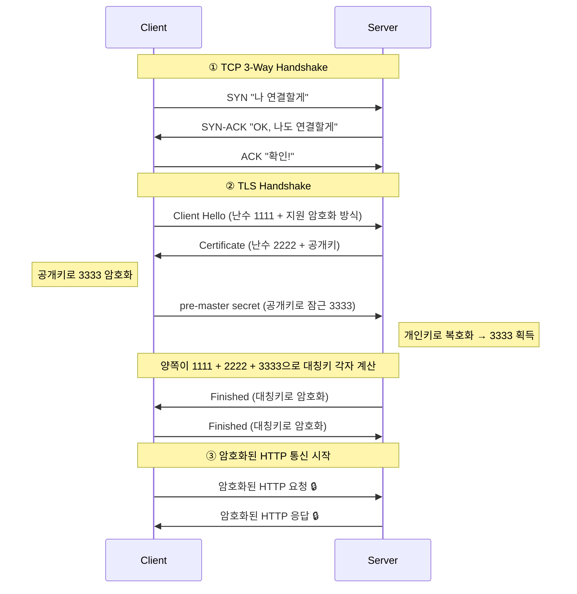

# 2026-04-02 (목) 학습 정리

## 📌 오늘 루틴

- 파트 1: 코딩테스트 Level 1 — 폰켓몬
- 파트 2: 오답 & 복습 — TCP / TLS / HTTP 개념 복습 & 면접 Q&A

---

## 파트 1 — 코딩테스트

### 문제: 폰켓몬 (Phonket Monster)

- **패키지:** `src/week3`
- **클래스명:** `Phonkemon`

#### 문제 설명

`nums` 배열에서 N/2마리를 선택할 때, 최대한 다양한 종류를 선택하는 최댓값 반환

#### 핵심 아이디어

```
정답 = min(N/2, 종류 수)
     = min(선택 가능한 마리 수, HashSet.size())
```

#### 최종 풀이 코드

```java
package week3;

import java.io.BufferedReader;
import java.io.IOException;
import java.io.InputStreamReader;
import java.util.*;

public class Phonkemon {

  public static void main(String[] args) throws IOException {
    BufferedReader br = new BufferedReader(new InputStreamReader(System.in));
    StringTokenizer st = new StringTokenizer(br.readLine());

    Set<Integer> set = new HashSet<>();
    int count = 0;

    while (st.hasMoreTokens()) {
      set.add(Integer.parseInt(st.nextToken()));
      count++;
    }

    System.out.println(Math.min(count / 2, set.size()));
  }
}
```

#### 복잡도 분석

|    | 복잡도  | 이유                  |
|----|------|---------------------|
| 시간 | O(N) | N개 순회하며 HashSet에 추가 |
| 공간 | O(N) | HashSet에 최대 N개 저장   |

#### 최적화 포인트

- 초기 풀이: `List → HashSet` 변환 → 공간 2N 사용
- 개선 풀이: List 제거, HashSet에 바로 추가 → 공간 N으로 축소

---

### 학습 포인트 — HashSet이 O(1)인 이유

HashSet은 내부적으로 **Hash Table** 구조를 사용한다.
값을 추가/탐색할 때 `hashCode()`로 인덱스를 계산해 바로 해당 위치에 접근하기 때문에 O(1)이다.
단, 해시 충돌이 발생하면 최악의 경우 O(N)이 될 수 있다.

```
hashCode(3) % 배열크기 = 인덱스
예) 3 % 10 = 3 → 3번 칸에 저장/탐색 → O(1)
```

| 자료구조      | 탐색 방식                   | 복잡도  |
|-----------|-------------------------|------|
| ArrayList | 처음부터 순서대로 탐색            | O(N) |
| HashSet   | hashCode로 위치 계산 후 바로 접근 | O(1) |

---

## 파트 2 — 네트워크 복습

### HTTPS 전체 통신 흐름



---

### ① TCP 3-Way Handshake

**왜 2-Way가 아닌 3-Way?**
클라이언트→서버 연결 확인 + 서버→클라이언트 연결도 확인해야 하기 때문.
2-Way면 서버가 클라이언트에게 제대로 전달되는지 알 수 없다.

---

### ② TLS Handshake

#### 재료 3가지

| 재료                | 출처                                 |
|-------------------|------------------------------------|
| client random     | Client Hello 때 클라이언트가 공개 전송        |
| server random     | Server Hello 때 서버가 공개 전송           |
| pre-master secret | 클라이언트가 공개키로 암호화해서 전송, 서버는 개인키로 복호화 |

#### 핵심 포인트

- 서버가 보내는 건 대칭키가 아니라 **공개키(인증서)**
- 대칭키는 **양쪽이 3가지 재료로 각자 계산** (전송 X)
- Finished 메시지로 **"우리 키 일치함"** 상호 확인

---

### 공개키 / 개인키 규칙

```
공개키로 잠금  →  개인키로만 열 수 있음   (TLS에서 사용)
개인키로 잠금  →  공개키로만 열 수 있음   (전자서명에서 사용)
```

|     | 설명          | 비유      |
|-----|-------------|---------|
| 공개키 | 누구나 잠글 수 있음 | 우체통 투입구 |
| 개인키 | 서버만 열 수 있음  | 우체통 열쇠  |

---

### ③ HTTP 데이터 전송

TLS Handshake 완료 후 **대칭키**로 암호화해서 데이터 주고받음

**왜 대칭키로 바꿔?**
공개키/개인키 방식은 수학 연산이 복잡해서 느리다.
핸드셰이크 때만 쓰고, 이후엔 빠른 대칭키로 통신!

---

## 면접 예상 질문

**Q1. HTTPS 통신 과정을 처음부터 끝까지 설명해보세요.**

> HTTPS는 크게 3단계로 이루어진다.
>
> 첫 번째로 TCP 3-Way Handshake로 연결을 수립한다. 클라이언트가 SYN을 보내고, 서버가 SYN-ACK으로 응답하고,
> 클라이언트가 ACK을 보내며 연결을 완료한다.
>
> 두 번째로 TLS Handshake를 진행한다. 클라이언트가 난수와 지원하는 암호화 방식을 보내고(Client Hello), 서버가 난수와
> 공개키가 담긴 인증서를 보낸다. 클라이언트는 pre-master secret을 공개키로 암호화해서 전송하고, 서버는 개인키로 복호화한다. 양쪽이
> 난수 두 개와 pre-master secret을 재료로 동일한 대칭키를 각자 계산하고, Finished 메시지로 키 일치를 상호 확인한다.
>
> 세 번째로 이후 HTTP 데이터는 대칭키로 암호화해서 주고받는다. 공개키 방식은 연산 비용이 크기 때문에 핸드셰이크에서만 사용하고, 이후엔
> 빠른 대칭키를 사용한다.

**Q2. HTTP와 HTTPS의 차이는?**

> HTTP는 데이터를 평문으로 전송하지만, HTTPS는 TLS로 암호화해서 전송한다. 또한 인증서로 서버의 신원을 검증할 수 있다. 포트는
> HTTP가 80, HTTPS가 443이다.

**Q3. 왜 대칭키를 직접 전송하지 않나요?**

> 대칭키를 직접 전송하면 중간에 탈취될 수 있다. 그래서 재료만 교환하고, 계산은 각자 해서 같은 키를 만드는 방식을 사용한다. 재료 중
> pre-master secret은 공개키로 암호화해서 전송하기 때문에 서버만 알 수 있어 안전하다.

**Q4. HashSet의 중복 제거가 왜 O(1)인가요?**

> HashSet은 내부적으로 Hash Table 구조를 사용한다. 값을 추가할 때 hashCode()로 인덱스를 계산해 바로 해당 위치에
> 접근하기 때문에 O(1)이다. 단, 해시 충돌이 발생하면 최악의 경우 O(N)이 될 수 있다.